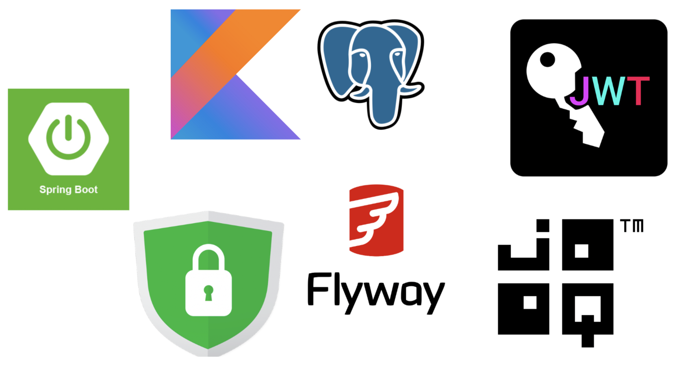

# Kotlin Spring Boot Projects

---
## Description
This is a repository containing sample projects using  **Kotlin** and **Spring Boot**
---

## Projects

[JIB](https://github.com/baggio1103/kotlin-spring-boot/tree/main/demo-jib) - 
a new tool that makes containerization of Java apps extremely fast
and easy. Dockerizing Spring Boot project without even a Docker daemon

[Kafka](https://github.com/baggio1103/kotlin-spring-boot/tree/main/kafka-example) -
integration with most famous Message Broker out there

[Jooq and Test containers with Flyway](https://github.com/baggio1103/kotlin-spring-boot/tree/main/jooq-tc-maven-demo) - 
a project that demonstrates the powers of **[Jooq](https://www.jooq.org/)** and **[Test Containers](https://testcontainers.com/)**. 
If you are fed up with **Hibernate** / **Spring Data Jpa**,
Jooq is another great tool for interacting with your
Database. **Test containers** is another great tool that makes
development a lot easier. Integration tests have always been painful
when it comes dealing with database or other external services.
Test Containers allow creating containers for test phase only, as soon as
test phase finishes execution, the containers are removed. 