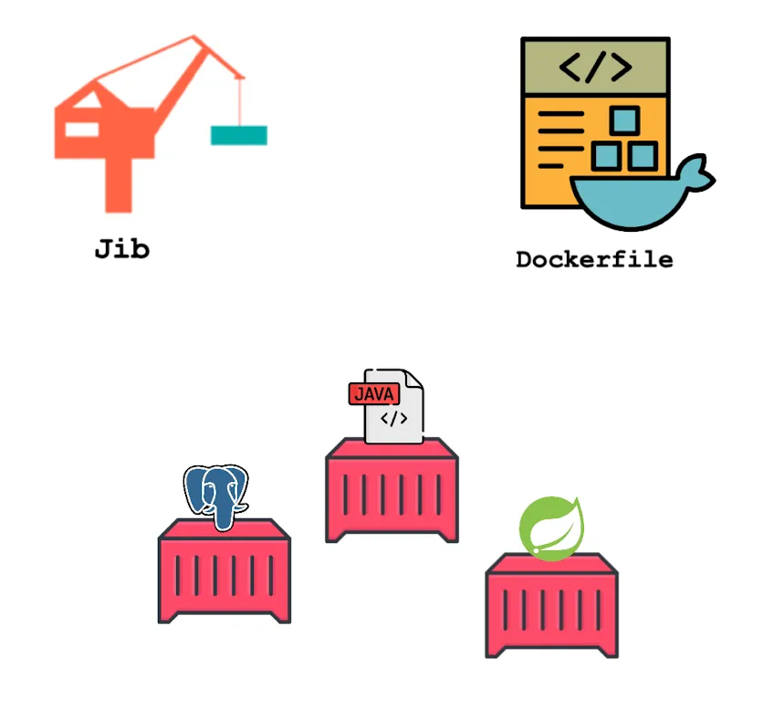

# Description

## Containerizing Java / Kotlin Applications: A Dual Approach with Dockerfile and Jib

--- 

---
As software architecture evolved and more applications embraced microservices architecture, the challenge of developing, deploying, and maintaining them quickly and consistently grew.

Docker 🐳 emerged as a game-changer, streamlining the development process and making it easier to build, deploy, and scale applications in a microservices-driven world.

In this post, I want to highlight how to dockerize a Spring Boot application using both approaches via Dockerfile and Jib, also explaining their pros and cons. Also, we run our containers at the end.

The post is available to read:
- [Medium]()
- [Substack](https://atomiccoding.substack.com/p/containerizing-java-kotlin-applications?r=23nm1x&utm_campaign=post&utm_medium=web&triedRedirect=true)

---
This is the source code of the post published on Medium and Substack.
